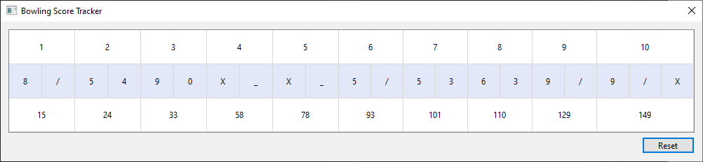

# interview-test-egs

## How to run
- Install requirements using `pip install -r requirements.txt`
- run `app.py`

(tested on Python 3.10)

## Usage

Using the keyboard, type
- an `x` or an `X` for a Strike
- an `/` for a Spare
- the numbers `0-9` for each shot if it is not a Strike or a Spare

Use the reset button to clear all values.